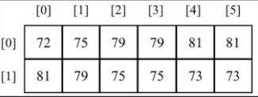
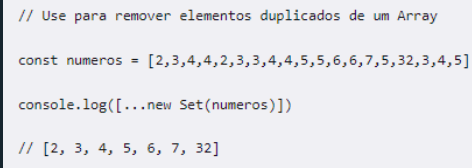
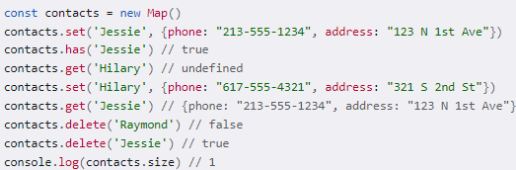

# Aula 3 - Prof Edson 

# 1. Pensamento Computacional 
## *Como uma solução é construída ?* 
    * Problema -> algorítmo -> Solução 
    * A partir do problema se traça caminhos e encontra a solução 
    * Para um problema várias soluções podem ser aplicadas 
    * Uma vez entendido o problema vem a parte da construção (programação)
        * Qual o problema 
        * Quais recursos vão ser usados 
    * *JavaScript* - será utilizado como linguagem de programação junto com o VSCode
    * Node.Js

# 1.Introdução 
## *Código Hello World* 
    * Navegue até a pasta do arquivo no terminal e insira "node "nomedoarquivo.js"
    *C:\Users\julia\Area de Trabalho\Dev FullStack  PUCRS\FullStackDeveloper\02.FundamentosComputaçãoAlgoritmos\06-Hello>node index.js*

## *O que é o JavaScript* 
    * é uma linguagem baseada em objetos 
    * Dinãmica 
    * Fracamente Tipada
    * Usualmente interpretada por navegadores 
    * Pode criar scripts que manipulam o HTML e O CSS - front 
    * Pode criar scripts para serem rodados no server-side - back 
    * extensão ".js"
# CONCEITOS BÁSICOS DA LINGUAGEM* 
    * Como criar variáveis ? 
        * São conhecidas 3 formas permitidas de variáveis 
            *let* - expressões que armazenam valor temporariamente e que podem ter seus valores modificados - Definir que variáveis vão ser utilizadas em pequenos espaços do código - não passa do bloco que foi criada 
                * Ex: let f_name = "Alex";
            *var* - expressões que armazenam valor temporariamente e que podem ter seus valores modificados - é utilizado num escopo global do código 
                * Ex: var age = 25;
            *const* - uma constante - define o valor para determidado recurso - seu valor não pode ser modificado 
    *Comandos de repetição 
        *for* - defino quantas vezes um trecho de código será repetido 
            * Construído a partir da definição de 3 Partes 
            * Uma inicialização - diz a partir de quanto começará a contar, enquanto for menor que um valor vai definindo a contagem 
            * Define quantas vezes um determinado trecho de código vai ser rodado no meu problema 
        *while* - permite a repetição mas não se sabe quantas vezes será executado 
            * Se a condição for verdadeira e enquanto ela se marnter verdadeira ele vai rodar a operação
        *do {statement} while {condition}*- permite a repetição mas não se sabe quantas vezes será executado 
            * Pelo menos 1 vez o treccho de código será executado 
            * posteriormente será feita a verificação, se não for verdadeira segue o problema 
    *Comandos de seleção 
        * Comandos de condição - Se uma condição for verdadeira, executa o trecho do código, se não for verdadeira, pula e passa para o próximo trecho
            *if* - 
            *if else* - 
            *Possivel colocar diversas formas de atuação dependendo do cenário necessário 
        * Comando tipo switch - Analisa a variável e diz que valor ela assume 
            *switch* - Se o foo tem o valor -1 existe um conjunto de condições a serem analisados, se for 0, outras, se for 1, outras 
            * Case padrão - comando break - todos os comando que estão associados estao no case, e antes de passar para o próximo faz o break para não passar para os próximos 
            *defaut*
        *Comando ternário - existe uma determinada condição para se analisar, se for verdadeira, executa uma determinada expressão e se não for executa outra 
            * Ex: var age = 26
                var beverage = (age>=21) ? "Beer" : "Juice";
                console.log(bevarage); // *"Beer"*

## 1.Modularização e Exemplo 
* Sempre que for trabalhar com as funções do JS, existe uma forma de escrever (sintaxe) que deve ser respeitada 
* vem da criação das funções e recursos que estarão sendo trabalhadas dentro do código 
* Escrever uma functions - definir os parametros e listar quais os parâmetros que vão ser utilizados 
    * Uma vez chamada a função vai ter um conjunto de comandos 
    * Funções que não retornam
    * funções que retornam algo 
    # Operações que se podem utilizar 
        Operadores aritméticos (+, -, *, /, %)
        • https://developer.mozilla.org/pt- BR/docs/Web/JavaScript/Reference/Operators#operadores_aritm%C3%A9ticos
        • Operadores de incremento e decremento (++, --)
        • https://developer.mozilla.org/pt- BR/docs/Web/JavaScript/Reference/Operators#incremento_e_decremento
        • Operadores relacionais (==, !=, <, <=, >, >=)
        • https://developer.mozilla.org/pt- BR/docs/Web/JavaScript/Reference/Operators#operadores_de_igualdade
        • https://developer.mozilla.org/pt- BR/docs/Web/JavaScript/Reference/Operators#operadores_relacionais
        • Operadores lógicos (&&, ||)
        • https://developer.mozilla.org/pt- BR/docs/Web/JavaScript/Reference/Operators#assignment_operators


Ex: 
```
function integrador(){
  for(let i=0; i<10; i++){
    if (i%2==0)
      console.log( i+":é par")
    else
      console.log(i+": é ímpar")
  }
}
integrador()

```
```
function avaliaParidade(limiteSuperior){
  for(let i=0; i<limiteSuperior; i++){
    if (i/2==1)
      console.log(i+":é um número impar")
    else
      console.log(i+": é um número par")
  }
}

avaliaParidade(10)
```

 C:\Users\julia\Area de Trabalho\Dev FullStack  PUCRS\FullStackDeveloper\02.FundamentosComputaçãoAlgoritmos\06-Hello> 

# Complexidade Algorítima
    * Sera se a solução que estamos criando é uma boa solução ou ela só resolve o problema
## Como saber se o algorítmo é eficiente 
    * O espaço ocupado deve ser avaliado 
    * O tempo gasto na execução 
    * Tempo de processamento 
    * Memória ocupada 
    * Largura de banda de comunicação 
    * Hardware necessário 
# Avaliação de Desempenho 
    * Contagem de tempo - não é uma boa prática avaliar baseado em tempo - depende de fatores externos como hardware 
    * Mensurar qual seria o melhor caso para uma solução 
    ## Contagem de Operações 
        * Quantas operações primitivas são executadas - instrução de baixo nível com o tempo constante 
        ### Operações primiticas 
            * Atribuição de valores a variáveis
            • Chamadas de métodos
            • Operações aritméticas (por exemplo, adição de dois números)
            • Comparação de dois números
            • Acesso a um arranjo
            • Retorno de um método
        * Para diferentes algorítmos ocorre diferentes tipos que contagens e elementos e custos 
*se tiver loop ela custa mais que uma função que não repete*

* Uma boa solução - é a que tem uma função constante 
* Se for um (log n) - ainda é boa 
* Se fica um cúbico, quadrático, exponencial, fatorial - começa a ficar pior 
* Nem toda solução pode ser trazida de forma ótima para a situação mais confortável para o custo computacional 


# Estrutura de Dados padrão da linguagem 
## Array 
* Vetor ou lista 
* Estrutura de dados simples 
* Armazena dados de forma contígona na memória - consegue manipular os elementos de forma mais fácil 
* Nativo no JS 
* Ver a documentação para entender melhor a estrutura 
    * Como resolver e solucionar os problemas dos códigos 
    * Utiliando metodos específicos e definidos por padrão 
* Evita a criação de múltiplas variáveis para o mesmo fim 
* Facilita "percorrer" os dados armazenados 
    #### Formas de declarar um array 
* let Variável = [] - crie uma variável que será um array 
    * Variável = [1,2,3,4,5,6,7] - associando os valores a variável 
* let Variável = new Array (); 
    * let Variável = new Array (7); - já reserva 7 espaços 
    * let Variável = new Array (1,2,3,4,5,6,7); - define as variáveis 
* Ambas as formas entregam o mesmo resultado. 
    #### Como manipular as informações do array depois ? 
* Nome da variavel que criou o vetor e [] para indicar a posição que quer manipular 
    * const fibonacci = []
    * fibonacci [1] = 1;
    * fibonacci [2] = 1;
    * for (let i = 3; i < 20; i++)
        fibonacci[i] = fibonacci [i - 1] + fibonacci [i - 2];
    * for (let i = 1; i < fibonacci.length; i++)
        console.log(fibonacci[i]);
    #### Metodos padrão para manipulação de array 
    • length: retorna o número de elementos na lista
    • push: Adiciona elemento na última posição do array
    • pop: remove o último elemento da lista
    • shift: remove o primeiro elemento da lista
    • unshift: adiciona elemento na primeira posição da lista
    • splice: adiciona valor em posição específica, permitindo remover outros
    • slice: retorna uma cópia do array
    • at(pos) ou [pos]: retorna elemento de posição especificada por pos

    #### Array Bidimensional / Matriz 
    * Bi, tridimensional - Matriz/Cubo 
    * Inicialmente decladaro como vetor, mas ao definir os elementos declara um array - como se fosse um combo de linhas e columas 
        * 
    
    #### Tipos Derivados de Array 
    * Pilha 
        * ultimo dado a dar entrada é o primeiro a sair (LIFO) 
        * push e pop
        * precisa remodelar a estrutura quando é acomodado 
            * tem um custo de hardware 
    * Fila 
        * Primeiro dado a dar entrada é o primeiro a sair (FIFO)
        * push e shift 
        * enqueue e dequeue - nomes diferentes para a mesma função de push e shift 
    * entender as complexidades envolvidas em cada uma da soluções 
    * Qual é o impacto para utilizar esse recurso e como eles funcionam na tecnologia 

## SET 
* Estrutura de dados simples 
* Armazena os dados de forma contígua na memória 
* Não permite que os dados armazenados estejam duplicados - conjunto único 
    * Mesmo que adicione os dados de forma duplicada 
* Não precisa armazenar só a mesma estrutura de dados - não precisa ser homogênio 
    * Pode ser número, texto, conjuntos 
* Usar o Set para remover valores duplicados de um array 
    


## Maps - Dicionários 
* Simples como um Array 
* Armazena os dados de forma contígua na memória - Estrutura é montada junta 
* Armazena valores a partir do Par 
    * Chaves + valor 
    * Chaves não se repetem - determinamos o valor a partir da chave não pela posição
    * Valores podem ser duplicados e aceitam qualquer tipo de dados, podem ser iguais 
    * Usa o set para inserir um novo valor 
    * 

# Listas encadeadas como estrutura de dados 
## Estrutura encadeada 
* Determinado numero de nodo, cada um com referência para o próximo 
* Trabalha o conceito de referência - tem a estrutura e tem a referência de onde está a próxima estrutura, mesmo que as infos estejam espalhadas existe uma noção de referência 
* Lista encadeadas = ligadas 

### Nodo  
* um nodo armazena uma informação e sabe onde está ou não o próximo nodo 
* Possui : 
    * Element - armazenamento de funções e estruturas - pode ser simples ou complexa dependendo do problema 
    * Next - onde está o próximo
* Class Node {
    constructor (element) {
        this.element = element;
        this.next = null; 
    }
}

* Pode colocar referências para o início ou final da fila 

#### Lista Encadeada
* Toda vez que tem que fazer uma manipulação , no início, meio e final, não tem que reajustar os valores em termo de meória, só remove o elemento e não precisa ajustar a memória 
* Acesso direto ao primeiro elemento (header) é obrigatório
* Acesso direto ao último elemento (tail) é desejável
* O uso somente da referência header é ineficiente para inserção de elementos no final da lista

##### Passo para inserir um novo elemento 
01. Alocação de um novo nodo 
02. Inserção das informações do nodo alocado 
03. Inserção do nodo na lista com consequente encadeamento nos nodos já existentes

*  Os seguintes métodos devem ser suportados:
    * add(e): insere um elemento no final da lista
    * add(index, e): insere um elemento em determinada posição (index) da lista
    * get(index)/set(index, e): get/set o elemento na posição index
    * remove(e): remove o elemento da lista
    * isEmpty(): retorna true se a lista está vazia
    * size(): retorna o número de elementos armazenados na lista
    * contains(e): retorna true se a lista contém o elemento
    * indexOf(e): retorna a posição onde o elemento está na lista
    * clear(): remove todos os elementos da lista

* https://github.com/loiane/javascript-datastructures-algorithms/blob/main/src/js/data-structures/linked-list.js

# Árvores como estrutura de dados 
* Estrutura de dados não linear 
* Permitem a implementação de vários algoritmos mais rápidos do que no uso de estruturas de dados lineares como as listas
* Estrutura de organização hierárquica 
* O número de elemento que eu referêncio para baixo da árvore é uma decisão e eles serão filhos 
* Não pode existir mais de um PAI 
* Dois nodos que são filhos de um mesmo pai são irmãos
* Um nodo v é externo se v não tem filhos - folha
* Um nodo v é interno se tem um ou mais filhos - galho 


# Recursão 
* "Para entender a recursão, é preciso entender antes a recursão.”
* Chamar uma função para resolver um problema e dentro de cada chamada pode chamar a mesma função para resolver o problema
* Loop infinito - filme inception 
* Metodo para resolver um problema, finaliza quando o problema original foi resolvido 
* Um método ou função será recursivo se ele puder chamar a si mesmo diretamente
* Exemplo para resolver fatorial

## Árvore 
* oportunidade de navegação atravéz da recurção 
* A Raiz da árvore é chamada de pai das subárvores 
*  As raízes das sub-árvores de um nodo são chamadas de irmãos, que, por sua vez, são filhos de seu nodo pai


    
