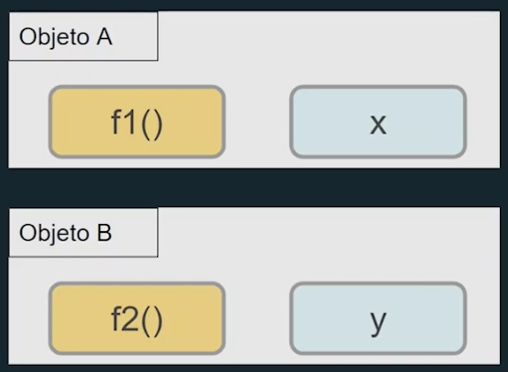

# POO - Programação Orientada a Objetos 
 Prof Alessandro Dias 

## Introdução 
* A programação orientada a Objetos é um **paradigma de programação**
    * Foco em **objetos** em vez de funções 
    * Objetos -> São uma estrutura mais complexas que funções 
* Não é uma linguagem de programação nem uma ferramenta ou framwork(conjunto de classes de uma linguagem) 
* **É um estilo e paradigma de programação**

    ### 1. Motivação 
    * Muitas linguagens atualmente **implementam ou dão suporte** a Orientação a objetos 
        * C++
        * C# 
        * Java
        * **JavaScript**
        * Python 
        * Ruby 
    * Conhecer paradigmas é **Essencial** para qualquer desenvolvedor de software 

## Contextualização 
* Programação estruturada 
    * Criada em 1940 
    * Por muito tempo só existia esse método 
    * Paradigma com foco em 
        * Sequência (como ensinar o computador a fazer o que queremos) - uma instrução é executada após a outra
        * Decisão (tomar caminhos diferentes dentro do mesmo programa) - uma instrução executada após um teste lógico 
        * Iteração (repetir) - um trecho de código pode repetir após algum teste lógico 

*Livro - Conceitos da linguagem de programação (Robert Sebesta)* 

* Programação procedural 
    * Pegou alguns conceitos da estruturada e tentou facilitar 
    *  Paradigma com foco no uso de procedimentos e funções para **facilitar o reuso**
    * Não deve ter mais que 10 linhas 
    * Estruturas da programação estruturadas e **quebrar trechos de códigos em funções**
    * O programa sabe o que a função faz e pode chamá-la quando precisar 
        * Começa a segmentar e simplificar o código 
    * dependendo de como separar pode até usar a mesma função em outros programas 

*Livro - Código Limpo (Robert Cecil)* - Boas práticas na programação 

* Programação estruturada e procedural 
    * Consegue separar os dados das funções 
    * Código mais enxuto e reutilizável 
    * Continuam com várias funções soltas e dados espalhados pelo código 
        * Várias funções se chamam e criam funções espalhadas em vários locais de forma confusa 
        *  - Grafo das funções (função espagheti)
    * Muito copia e cola de funções 
    * Mudanças em uma função resultam em mudanças em outras funções (dificuldade em descobrir onde estava o problema)
    * Interdependência entre as funções (uma depende da outra e precisa saber completamente o que ela faz)
    * funcionava, mas era muito complexo para dar manutenção no código 

*Ler a documentação do JS, StackOverflow*

## Programação Orientada a Objeto 
* Paradigma com foco no uso de objetos, onde cada um contém suas variáveis e funções 
* Construída em cima da programação estruturada e procedural 
    * Objeto A ( função dele (Conjunto de dados dele))
    * Objeto B ( função dele (Conjunto de dados dele))
    * 
    * **Tudo o que é Dado do Objeto chama de atributo ou propriedade**
    * **Tudo o que é função se chama método** - pode retornar ou não algo 
    * Um objeto pode ou não ter variáveis ou atributos
* Objetos possui um conjunto de componentes 

* Componentes 
    * Diagrama de objetos - UML 
        * Nome (Dispositivo) - Diferenciar os objetivos 
        * Atributos (Fabricante, modelo) - informações, dados do objetos - representam o estado do objeto (o que é e o que representa)
        * Métodos ( Comportamentos, ligar, diminuirVolume) - ação (o que o objeto pode fazer)

## Objeto 
* Tem atributos, método e nome 
* Coleção de dados e funcionalidades que tem alguma relação entre si 
    * Dados -> variáveis (Atributos ou propriedades) -> Na Orientação a objetos tudo isso é a mesma coisa
    * Funcionalidades -> Funções (métodos, comportamentos)
* No **Java Script** atributos e métodos são membros de um objeto, cada um com um nome e um valor 
* Em JS Até o objeto vazio possui algo dentro dele 
* Um objeto em Js é composto por membros que tem **nome e valores** 
* Em Js tudo eventualmente vira um objeto 
* Em JavaScript, atributos e métodos são membros de um objeto, cada um com um nome e um valor
    * var nomeDoObjeto = {
        nomeMembro1: valorMembro1,
        nomeMembro2: valorMembro2,
        nomeMembro3: valorMembro3,
    };
    * var pessoa = {
        nome: "Valentina", 
        idade: 60,
        saudar: function() {
            console.log("Olá")
        }
    }